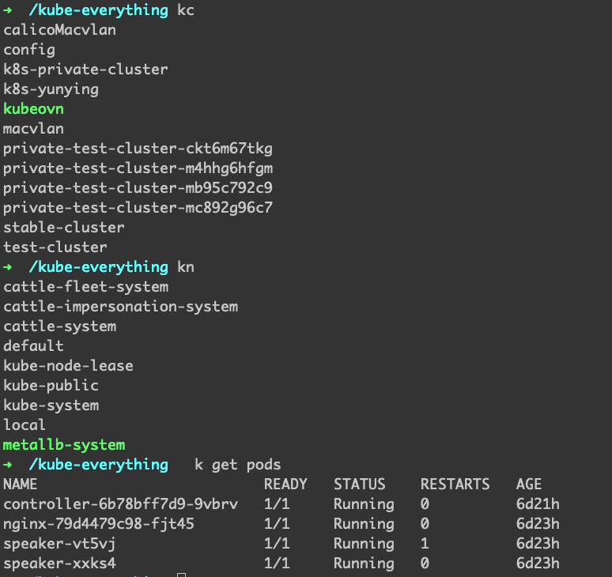

# kube-everything

这个项目主要是为了用一个镜像把平时在做 k8s 开发过程中需要用到的软件和 alias 一次性配置完，这样不管我怎么切换环境，只要有 Docker 就能用起来。

## 安装的软件

细节都在 [Dockerfile](Dockerfile) 了，可以仔细看看，如果想加什么的，也可以随便加。

## Docker Hub镜像

```shell
docker pull runzhliu/kube-everything:latest
# 挂载主机的/root/.kube目录
cp ~/.kube/config /tmp/config && docker run -v /tmp/config:/root/.kube --net=host -it runzhliu/kube-everything:latest
# 绑定主机的bash_history，方便搜命令
cp ~/.kube/config /tmp/config && docker run -v /tmp/config:/root/.kube -v /root/.bash_history:/root/.bash_history --net=host -it runzhliu/kube-everything:latest
```

## 使用



## TODO

- [ ] 常用的kubectl插件
- [ ] 网络排查工具和脚本
- [ ] 提供参数更新工具版本
- [x] 安装helm
